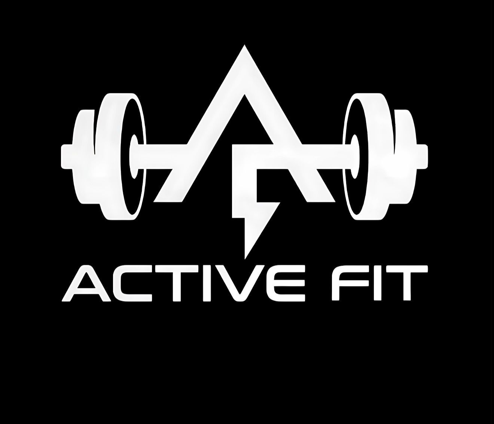

# Active Fit Gym

Sitio web desarrollado con React y Vite para el gimnasio **Active Fit**, con el objetivo de presentar información del gimnasio, sus servicios, membresías, horarios, entrenadores, ubicación y medios de contacto.

## Descripción del proyecto

Active Fit es una página web moderna, visual y responsive orientada a mostrar la identidad del gimnasio. El sitio permite al usuario navegar entre diferentes secciones, conocer los planes disponibles, revisar horarios, ver información de entrenadores, contactar por WhatsApp o correo, y consultar cómo llegar al local.

El proyecto fue creado con una estética fitness moderna, usando colores oscuros, efectos visuales, botones llamativos, tarjetas con transparencia, carrusel de imágenes y navegación organizada mediante React Router.

## Tecnologías utilizadas

- React
- Vite
- React Router DOM
- React Icons
- HTML5
- CSS3
- JavaScript
- LocalStorage

## Funcionalidades principales

- Página de inicio con carrusel de imágenes.
- Menú de navegación con submenús desplegables.
- Página de servicios del gimnasio.
- Página de membresías con planes y precios.
- Página de horarios.
- Página de entrenadores.
- Página de contacto con WhatsApp y correo.
- Página de ubicación “Cómo llegar”.
- Sistema simulado de registro e inicio de sesión usando LocalStorage.
- Página de perfil del usuario.
- Música de fondo activable desde el encabezado.
- Diseño responsive para computadora, tablet y celular.

## Estructura general del proyecto

```txt
active-fit-react
├─ public
│  ├─ img
│  └─ audio
├─ src
│  ├─ components
│  │  ├─ Header.jsx
│  │  ├─ Footer.jsx
│  │  ├─ BackgroundMusic.jsx
│  │  └─ ScrollToTop.jsx
│  ├─ hooks
│  │  ├─ useReveal.js
│  │  ├─ useGlobalButtonSounds.js
│  │  └─ usePageTransitionSound.js
│  ├─ pages
│  │  ├─ Home.jsx
│  │  ├─ Nosotros.jsx
│  │  ├─ Servicios.jsx
│  │  ├─ Membresias.jsx
│  │  ├─ Horarios.jsx
│  │  ├─ Entrenadores.jsx
│  │  ├─ ComoLlegar.jsx
│  │  ├─ FAQ.jsx
│  │  ├─ Contacto.jsx
│  │  ├─ Login.jsx
│  │  ├─ Registro.jsx
│  │  └─ Perfil.jsx
│  ├─ App.jsx
│  ├─ main.jsx
│  └─ index.css
├─ package.json
├─ package-lock.json
├─ vite.config.js
└─ README.md

